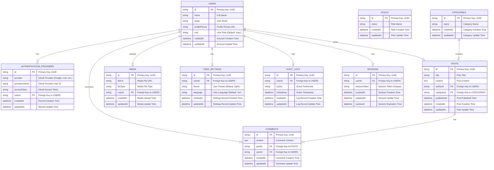

```mermaid
erDiagram
    USERS {
        string id PK "Primary Key, UUID"
        string name "Full Name"
        string email "User Email"
        string profilePicture "Profile Picture URL"
        string role "User Role (Default: 'user')"
        datetime createdAt "Account Creation Time"
        datetime updatedAt "Account Update Time"
    }

    AUTHENTICATION_PROVIDERS {
        string id PK "Primary Key, UUID"
        string provider "OAuth Provider (Google, Line, etc.)"
        string providerUserId "OAuth Provider User ID"
        string accessToken "OAuth Access Token"
        string userId FK "Foreign Key to USERS"
        datetime createdAt "Record Creation Time"
        datetime updatedAt "Record Update Time"
    }

    ROLES {
        string id PK "Primary Key, UUID"
        string name "Role Name"
        datetime createdAt "Role Creation Time"
        datetime updatedAt "Role Update Time"
    }

    POSTS {
        string id PK "Primary Key, UUID"
        string title "Post Title"
        text content "Post Content"
        string authorId FK "Foreign Key to USERS"
        string categoryId FK "Foreign Key to CATEGORIES"
        datetime publishedAt "Post Published Time"
        datetime createdAt "Post Creation Time"
        datetime updatedAt "Post Update Time"
    }

    CATEGORIES {
        string id PK "Primary Key, UUID"
        string name "Category Name"
        datetime createdAt "Category Creation Time"
        datetime updatedAt "Category Update Time"
    }

    COMMENTS {
        string id PK "Primary Key, UUID"
        text content "Comment Content"
        string postId FK "Foreign Key to POSTS"
        string userId FK "Foreign Key to USERS"
        datetime createdAt "Comment Creation Time"
        datetime updatedAt "Comment Update Time"
    }

    MEDIA {
        string id PK "Primary Key, UUID"
        string fileUrl "Media File URL"
        string fileType "Media File Type"
        string userId FK "Foreign Key to USERS"
        datetime createdAt "Media Upload Time"
        datetime updatedAt "Media Update Time"
    }

    USER_SETTINGS {
        string id PK "Primary Key, UUID"
        string userId FK "Foreign Key to USERS"
        string theme "User Theme (Default: 'light')"
        string language "User Language (Default: 'en')"
        datetime createdAt "Settings Record Creation Time"
        datetime updatedAt "Settings Record Update Time"
    }

    AUDIT_LOGS {
        string id PK "Primary Key, UUID"
        string userId FK "Foreign Key to USERS"
        string action "Action Performed"
        datetime timestamp "Action Timestamp"
        datetime createdAt "Log Record Creation Time"
        datetime updatedAt "Log Record Update Time"
    }

    SESSIONS {
        string id PK "Primary Key, UUID"
        string userId FK "Foreign Key to USERS"
        string sessionToken "Session Token (Unique)"
        datetime createdAt "Session Creation Time"
        datetime updatedAt "Session Update Time"
        datetime expiresAt "Session Expiration Time"
    }

    USERS ||--o| AUTHENTICATION_PROVIDERS : "has"
    USERS ||--o| POSTS : "writes"
    USERS ||--o| COMMENTS : "comments"
    USERS ||--o| MEDIA : "uploads"
    USERS ||--o| USER_SETTINGS : "has"
    USERS ||--o| AUDIT_LOGS : "logs"
    USERS ||--o| SESSIONS : "has"

    CATEGORIES ||--o| POSTS : "contains"
    POSTS ||--o| COMMENTS : "has"

```