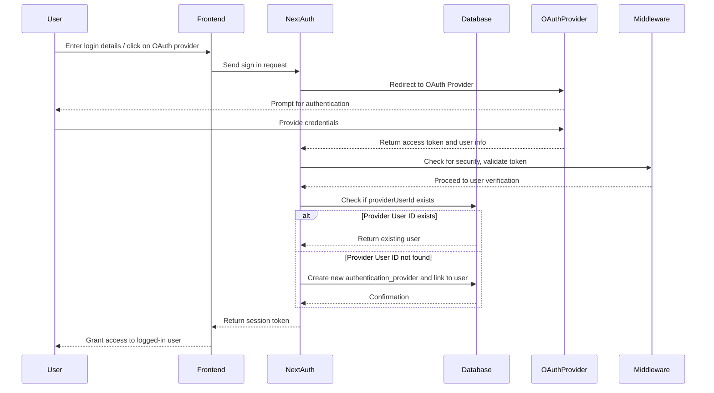

# Sequence Diagram

## ขั้นตอนการทำงานของระบบ

### Sign In Process
 - User กรอกข้อมูลลงในแบบฟอร์มเพื่อเข้าสู่ระบบหรือเลือกใช้ OAuth provider (เช่น Google, Facebook).
 - Frontend ส่งคำขอเข้าสู่ระบบ (Sign In) ไปยัง NextAuth.
 - NextAuth ส่งการเชื่อมโยงไปยัง OAuthProvider เพื่อให้ผู้ใช้ทำการยืนยันตัวตน.
 - OAuthProvider แสดงหน้าต่างการยืนยันตัวตนให้กับผู้ใช้.
 - User ให้ข้อมูลรับรอง (เช่น ชื่อผู้ใช้และรหัสผ่าน) ให้กับ OAuthProvider.
 - OAuthProvider ส่งข้อมูลการเข้าถึง (access token) และข้อมูลผู้ใช้กลับไปยัง NextAuth.
 - NextAuth ใช้ Middleware เพื่อตรวจสอบและดำเนินการก่อนการเข้าถึงข้อมูลผู้ใช้.
 - Middleware ตรวจสอบข้อมูล เช่น ความปลอดภัยหรือการยืนยันตัวตนเบื้องต้น แล้วส่งข้อมูลที่เกี่ยวข้องไปยัง NextAuth.
 - NextAuth ตรวจสอบใน Database ว่ามี providerUserId ของผู้ใช้ที่เกี่ยวข้องหรือไม่.

    1. หากมี providerUserId ในฐานข้อมูลแล้ว, Database จะส่งผู้ใช้ที่มีอยู่กลับไปยัง NextAuth.
    2. หากไม่พบ providerUserId, NextAuth จะสร้างการเชื่อมโยงกับ authentication_provider และเชื่อมโยงกับผู้ใช้ใหม่ใน Database.

### Login Process
 - หลังจากที่ผู้ใช้เข้าสู่ระบบแล้ว, NextAuth ส่ง session token กลับไปยัง Frontend.
 - Frontend รับ session token และให้สิทธิ์การเข้าถึงแก่ผู้ใช้ที่เข้าสู่ระบบสำเร็จ (Login).